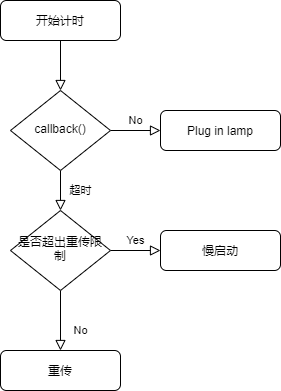
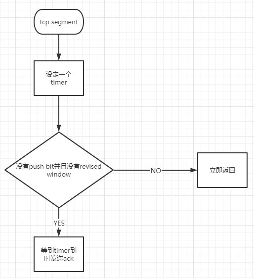
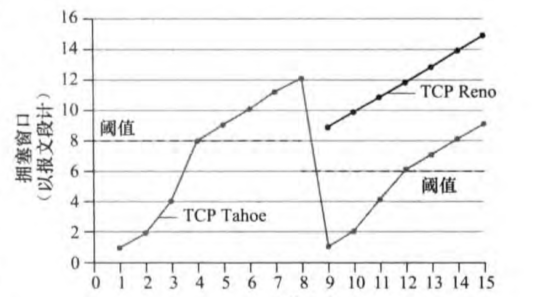

<div class="cover" style="page-break-after:always;font-family:方正公文仿宋;width:100%;height:100%;border:none;margin: 0 auto;text-align:center;">
    <div style="width:60%;margin: 0 auto;height:0;padding-bottom:10%;">
        </br>
        
    <div style="text-align: center; font-family:华文黑体Bold; font-size:26px; font-weight:900;">
        TrivialTCP设计文档
    </div>
    </br></br>
    <div style="width:60%;margin: 0 auto;height:0;padding-bottom:40%;">
        
	</div>
</br></br></br>
    <table style="border:none;text-align:center;width:80%;font-family:仿宋;font-size:14px; margin: 0 auto;">
    <tbody style="font-family:方正公文仿宋;font-size:12pt;">
    	<tr style="font-weight:normal;"> 
    		<td style="width:20%;text-align:right;">学&nbsp;&nbsp;&nbsp;&nbsp;&nbsp;&nbsp;院</td>
    		<td style="width:2%">：</td> 
    		<td style="width:40%;font-weight:normal;border-bottom: 1px solid;text-align:center;font-family:华文仿宋"> 智能与计算学部 </td>     </tr>
    	<tr style="font-weight:normal;"> 
    		<td style="width:20%;text-align:right;">专&nbsp;&nbsp;&nbsp;&nbsp;&nbsp;&nbsp;业</td>
    		<td style="width:2%">：</td> 
    		<td style="width:40%;font-weight:normal;border-bottom: 1px solid;text-align:center;font-family:华文仿宋" >计算机科学与技术 </td>   </tr>
    	<tr style="font-weight:normal;"> 
    		<td style="width:20%;text-align:right;">姓&nbsp;&nbsp;&nbsp;&nbsp;&nbsp;&nbsp;名</td>
    		<td style="width:2%">：</td> 
    		<td style="width:40%;font-weight:normal;border-bottom: 1px solid;text-align:center;font-family:华文仿宋">齐呈祥 高树韬</td>     </tr>
    </tbody>              
    </table>
</br>
	<div style="text-align:center; font-family:华文仿宋; font-size:15pt; font-weight:750;">
      2021年 8月 25日   
	</div>
</div> 
</div>


# TCP模块预览


# 模块简介

## 可靠传输

通过ACK SEQ来确保TCP段的正确接收，通过校验和等方式确认收到的段是否正确，通过五元组确认是否收到了正确连接的TCP段。

## 流量控制

通过改善窗口算法，延迟ACK算法以及Nagle算法，根据接收方的窗口大小，对TCP段的发送进行管理，防止缓冲区收到过多的数据而被迫丢弃或者SWS现象（愚蠢窗口综合征）。

## 连接管理

TCP协议要求客户端和服务端通过三次握手发起连接。首先，由客户端调用 connect() 方法主动向服务端发起连接，向服务端发送带有 SYN 标志段的 packet，当服务端接受到分组后向客户端返回带有 ACK 标志位，随后客户端向服务端发送带有 ACK 标志位的分组，至此三次握手正式完成。

断开连接与连接过程类似，同样由一端发起断开连接请求（即发送 FIN 标志位的报文），双方经过协商与状态机转换后最终同时关闭连接并释放资源。

## 拥塞控制

**TCP的四种拥塞控制算法**

- 慢启动
- 拥塞控制
- 快重传
- 快恢复


# 模块详细设计

## 可靠传输

### 完全可信信道上的可靠传输

如果信道完全可靠，那么可靠传输就不成问题了，此时的可靠传输非常简单。发送方只需要将数据放到信道上它就可以可靠的到达接收方，并由接收方接收。但是这种信道是完全理想化的，不存在的。

 

### 会出现比特错误的信道上的可靠传输

更现实一点的信道是会发生比特错误的，假设现在需要在除了会出现比特错误之外，其它的特性和完全可靠信道一样的信道上进行可靠传输.

为了实现该信道上的可靠传输：

- 接收方：需要确认信息是否就是发送方所发送的，并且需要反馈是否有错误给发送方
- 发送方：需要在发送的信息中添加额外信息以使得接收方可以对接收到的信息是否有错误进行判断，并且需要接收接收方的反馈，如果有错误发生就要进行重传

因而在这种信道上进行传输需要三种功能：

- 差错检测：发送方提供额外信息供接收方进行校验，接收方进行校验以判断是否有错误发生。网络协议一般采用校验和来完成该任务
- 接收方反馈：接收方需要将是否有错误发生的信息反馈给发送方，这就是网络协议中最常见的ACK（确认）/NAK（否定的确认）机制
- 发送方重传：在出现错误时，发送方需要重传出错的分组。重传也是网络协议中极常见的机制。

上述机制还有问题，它没有考虑接收方的反馈出现比特错误 即 反馈受损 的情形。采用上述机制，在反馈受损时，发送方可以了解到这个反馈信息出现了错误，但是它无法知道反馈的是什么样的信息，因此也就无法知道自己该怎么应对。

这可以有两种解决办法：

- 发送方提供足够多的信息，使得接收方不仅可以检测比特错误，而且可以恢复比特错误。这在仅会发生比特错误的信道上是理论可行的，代价是需要大量额外的信息。
- 如果收到了受损的反馈，则都认为是出现了错误，就进行重传。但是这时就可能引入冗余的分组，因为被重传的分组可能已经正确的被接收了。

网络协议中广泛采用的是第2种解决方案，冗余分组可以通过一种简单的机制来解决，这就是分组序列号。被发送的每个分组都有一个序列号，接收方只需要检测该序列号就可以知道分组是否是冗余的。

 

在引入序列号后，该机制已经可以在这种信道上工作了。不过它还可以做一点变化，有些网络协议中并不会产生否定的确认（即报告发送方出现了错误），它采用的是继续为 已经为之发送过ACK的最后一个正确接收的分组 发送ACK。当发送方收到冗余的ACK时就知道跟在被冗余ACK确认的分组之后的分组没有被正确接收，这就达到了NAK所要的效果。


## 连接管理

### 三次握手

TCP协议要求客户端和服务端通过三次握手发起连接。首先，由客户端调用 `connect()` 方法主动向服务端发起连接，向服务端发送带有 `SYN` 标志段的 packet，当服务端接受到分组后向客户端返回带有 `ACK` 标志位，随后客户端向服务端发送带有 `ACK` 标志位的分组，至此三次握手正式完成。  

当服务端接受到 `SYN` packet 之后，会将新建客户端 socket并将其加入到半连接队列中`syns_socks`中，我们 `socket` 队列的定义如下:

```c
typedef struct sock_node {
    tju_tcp_t* data;
    struct sock_node* next;
} sock_node;

typedef struct sock_queue {
    int size;
    sock_node* base;
} sock_queue;
```

其中我们为 `sock_queue` 实现了队列的各种基础算法。   

当服务端再次接受到客户端发来的 `ACK` 报文时，则将半连接队列中的 `scoket` 发送给全连接队列 `accept_socks`，此时 `accept()` 方法中检测到 `accept_socks` 中收到的分组，随后则将监听 `socket` 状态修改为 `ESTABLISHED`,并加入 `established_socks` 中。   

客户端的处理过程与服务端类似， `connect()` 主动向服务端发送报文，随后阻塞等待直到 `connect_sock` 不为 NULL。  

其中关于接收报文的过程则在一个子线程中进行。当内核检测到接受到分组后，则将其交给 `onTCPPocket()` 来处理分组，其中， `onPocket()`分为不同情况来处理分组：

```c
int onTCPPocket(char* pkt){
    // 当我们收到TCP包时 包中 源IP 源端口 是发送方的 也就是我们眼里的 远程(remote) IP和端口
    uint16_t remote_port = get_src(pkt);
    uint16_t local_port = get_dst(pkt);
    // remote ip 和 local ip 是读IP 数据包得到的 仿真的话这里直接根据hostname判断
    // 获取是server还是client
    int is_server;
    char hostname[8];
    gethostname(hostname, 8);
    uint32_t remote_ip, local_ip;
    if(strcmp(hostname,"server")==0){ // 自己是服务端 远端就是客户端
        local_ip = inet_network("10.0.0.3");
        remote_ip = inet_network("10.0.0.2");
        is_server = 1;
    }else if(strcmp(hostname,"client")==0){ // 自己是客户端 远端就是服务端 
        local_ip = inet_network("10.0.0.2");
        remote_ip = inet_network("10.0.0.3");
        is_server = 0;
    }

    int hashval;

    // 首先查找已经建立连接的socket哈希表
    // 根据4个ip port 组成四元组 查找有没有已经建立连接的socket
    hashval = cal_hash(local_ip, local_port, remote_ip, remote_port);
    if (established_socks[hashval] != NULL) {
        // 这里应当判断是否发送FIN packet, 或者socket的状态不是ESTABLIED
        int new_hash = cal_hash(local_ip, local_port, 0, 0);
        if(is_server && (is_fin(pkt) || listen_socks[new_hash]->state != ESTABLISHED)) {
            return tcp_state_close(listen_socks[new_hash], pkt);
        }else if(!is_server &&(is_fin(pkt) || connect_sock->state != ESTABLISHED)) {
            return tcp_state_close(connect_sock, pkt);
        }else {
            tju_handle_packet(established_socks[hashval], pkt);
            return 0;
        }
    }

    tju_sock_addr conn_addr;
    conn_addr.ip = remote_ip;
    conn_addr.port = remote_port;
    

    hashval = cal_hash(local_ip, local_port, 0, 0);
    // 没有的话再查找监听中的socket哈希表
    if (listen_socks[hashval] != NULL && is_server) {
        // 监听的socket只有本地监听ip和端口 没有远端
        printf("Server receive status packet.\n");
        return tcp_rcv_state_server(listen_socks[hashval], pkt, &conn_addr);
    }

    if (connect_sock != NULL && !is_server) {
        printf("Client receive status packet.\n");
        return tcp_rcv_state_client(connect_sock, pkt, &conn_addr);
    }

    // 都没找到 丢掉数据包
    printf("找不到能够处理该TCP数据包的socket, 丢弃该数据包\n");
    return -1;
}
```

其中， `tcp_rcv_state_server()` 和 `tcp_rcv_state_client()` 方法来分别处理服务端与客户端握手时的状态机转换过程。


### 断开连接（四次挥手）

断开连接与连接过程类似，同样由一端发起断开连接请求（即发送 `FIN` 标志位的报文），双方经过协商与状态机转换后最终同时关闭连接并释放资源。  

三种情况：

- 一端主动申请关闭
- TCP从网络中接受到了FIN标志位的分组
- 两端同时关闭连接


## 定时器的设计

当应用程序创建 socket 时，我们将会调用 `tcp_init_timer()` 为计时器进行初始化，其中 `timeout` 域先设置为1，注册`callback`, 随后当我们开始传输分组时，我们调用回调函数开始计时。  

当我们受到 ACK 之后，我们需要调用  `tcp_ack_update_rtt()` 来更新 RTT， 其中 `tcp_ack_update_rtt()` 实现如下：

```c
int tcp_ack_update_rtt(tju_tcp_t* sock, float seq_rtt_us, float sack_rtt_us) {

    /* Prefer RTT measured from ACK's timing to TS-ECR. This is because
	 * broken middle-boxes or peers may corrupt TS-ECR fields. But
	 * Karn's algorithm forbids taking RTT if some retransmitted data
	 * is acked (RFC6298).
	 */
	if (seq_rtt_us < 0)
		seq_rtt_us = sack_rtt_us;

    tcp_set_estimator(sock, seq_rtt_us);
    tcp_set_rto(sock);
    return 0;
}
```

我们需要分别对 `extimator_rtt` 和 `dev_rtt` 进行更新之后再去设置 `timeout`。

定时器的结构设计如下所示：

```c
typedef struct rtt_timer_t {
    float estimated_rtt;
    float dev_rtt;
    float timeout;
    void (*callback)(tju_tcp_t* sock);
} rtt_timer_t;
```

其中包含定时器计算 RTT 的基础数据域以及回调函数 `callback()`，其中，我们需要将回调函数注册为 ` tcp_write_timer_handler()`，`tcp_write_timer_handler()` 的处理流程为开始计时即调用函数，倘若在规定时间内未收到 ACK，则根据 socket 当前的状态进行处理，例如超时则需要重传，倘若超出了重传次数，则需要启用慢启动重新开始。下图为该过程的一个图示： 



关于定时器如何监测是否超时，首先，我们调用 `time_after()` 来判断是否超时，在该函数中我们新建一个线程开始计时，并通过通道监测信号量：


```c
// 检查是否超时
int time_after(tju_tcp_t* sock) {
    // 这里我们通过通道进行异步监测时钟，倘若计时器到时而没有收到ACK
    // 则通过channel发送对应的信号量， 倘若收到对应的ACK则返回对应的信号量
    // 通道的使用同golang channel.
    sock->rtt_timer->chan = chan_init(0);
    int signal;
    pthread_t* thread;
    pthread_create(&thread, NULL, __check__timeout, (void*)sock);

    switch (chan_select(&sock->rtt_timer->chan, NULL, &signal, NULL, 0, NULL)) {
        case 0:
            if(signal == TIMEOUT_SIGNAL) {
                // timeout
                return 1;
            }else if(signal == ACK_SIGNAL) {
                // ack
                return 0;
            }
        default:
            printf("no received message.\n");
    }

    chan_dispose(sock->rtt_timer->chan);
}
```

在异步函数中我们不断阻塞直到超时或者收到ACK：

```c
void* __check__timeout(tju_tcp_t* sock) {
    float timeout = sock->rtt_timer->timeout;
    time_t cur_time = time(NULL);
    time_t out_time = cur_time + timeout;
    while(time(NULL) < out_time) {
        // 检查信号量
        if(TRUE) {
            float mtime = time(NULL) - cur_time;
            tcp_stop_timer(sock, mtime);
            chan_send(sock->rtt_timer->chan, (void*)ACK_SIGNAL);
        }
    }
    chan_send(sock->rtt_timer->chan, (void*)TIMEOUT_SIGNAL);
}
```

当受到 ACK 时，我们重置计时器，否则返回超时的信号量。根据不同的 socket 状态进行处理：

```c
// 当计时器超时时的回调函数
void tcp_write_timer_handler(tju_tcp_t* sock) {
    if(!time_after(sock)) {
        // 收到ack
        return;
    }

    // 这里需要针对socket的状态进行不同的操作
    switch(sock->state) {
        case SYN_RECV:
            printf("transmit RST.\n");
        ...
        ...
        case ESTABLISHED: 
            tcp_retransmit_timer(sock);
        default:
            printf("Unresolved status.\n");
    }
}


```

## 流量控制

### 改进窗口算法

发送方根据接收方的rwnd,已接受的ack和发送的seq计算出接收方的useable window size, 如果其比值小于某个阈值则延迟发送新的数据，仅仅发送一个HEAD用于维持链接。

实现如下所示：

Tju_tcp中的 `void calculate_sending_buffer_depend_on_rwnd(tju_tcp_t* sock);` 根据rwnd计算出uwnd然后相应的计算出最大的可发送长度，然后调用 `sending_buffer_to_layer3(sock,sock->sending_len,TRUE);`

函数将可发送的最大长度的数据从`sending_buffer`中发送出去并且将最后一个段的push bit 标记为 1 用于告知接收方该段为最后一个段。

### 改善确认算法

前提：receiver 才能控制ACK 需要一个timer计数

当收到一个TCP段的时候，如果同时满足push bit  没有被设置并且没有revised window需要发回，那么就设置一个timer，间隔时间为大致为200ms~300ms，最合适的时间为自适应算法。

`void handle_delay_ack(tju_tcp_t* sock, char* pkt)`

在 `handle_TCP_PKT` 函数调用于控制ACK返回的延迟具体逻辑详见下图：




## 拥塞控制

### Slow Start（慢启动）

（ssthresh：slow start thresh，慢启动门限值）

当cwnd的值小于 ssthresh 时，TCP 则处于 slow start 阶段，每收到一个 ACK，cwnd的值就会加1。

经过一个RTT的时间，cwnd的值就会变成原来的两倍，为指数增长。

### Congestion Avoidance（拥塞避免）

当 cwnd 的值超过 ssthresh 时，就会进入 Congestion Avoidance 阶段，在该阶段下，cwnd以线性方式增长，大约每经过一个 RTT，cwnd 的值就会加1

### Fast Retransmit（快重传）

按照拥塞避免算法中 cwnd 的增长趋势，迟早会造成拥塞（一般通过是否丢包来判断是否发生了拥塞）。

如果中网络中发生了丢包，通过等待一个 RTO 时间后再进行重传，是非常耗时的，因为 RTO通常设置得会比较大（避免伪重传：不必要的重传）。

快重传的思想是：只要发送方收到了三个重复的 ACK，就会立马重传，而不用等到 RTO 到达（如果没有3个重复的 ACK 而包丢失了，就只能超时重传）；

并且将 ssthresh 的值设置为当前 cwnd 的一半，而cwnd减为1，重回slow start阶段。

### Fast Recovery（快速恢复）算法。

当收到三个重复的 ACK 或是超过了 RTO 时间且尚未收到某个数据包的 ACK，Reno 就会认为丢包了，并认定网络中发生了拥塞。

Reno 会把当前的 ssthresh 的值设置为当前 cwnd 的一半，但是并不会回到 slow start 阶段，而是将cwnd设置为（更新后的）ssthresh+3MSS，之后cwnd呈线性增长。


