<div class="cover" style="page-break-after:always;font-family:方正公文仿宋;width:100%;height:100%;border:none;margin: 0 auto;text-align:center;">
    <div style="width:60%;margin: 0 auto;height:0;padding-bottom:10%;">
        </br>
        
    <div style="text-align: center; font-family:华文黑体Bold; font-size:26px; font-weight:900;">
        计算机网络实践报告
    </div>
    </br></br>
    <div style="width:60%;margin: 0 auto;height:0;padding-bottom:40%;">
        
	</div>
</br></br></br>
    <table style="border:none;text-align:center;width:80%;font-family:仿宋;font-size:14px; margin: 0 auto;">
    <tbody style="font-family:方正公文仿宋;font-size:12pt;">
    <tr style="font-weight:normal;"> 
    		<td style="width:20%;text-align:right;">学&nbsp;&nbsp;&nbsp;&nbsp;&nbsp;&nbsp;号</td>
    		<td style="width:2%">：</td> 
    		<td style="width:40%;font-weight:normal;border-bottom: 1px solid;text-align:center;font-family:华文仿宋">3019244189 3019244360</td>     </tr>
    		<tr style="font-weight:normal;"> 
    		<td style="width:20%;text-align:right;">姓&nbsp;&nbsp;&nbsp;&nbsp;&nbsp;&nbsp;名</td>
    		<td style="width:2%">：</td> 
    		<td style="width:40%;font-weight:normal;border-bottom: 1px solid;text-align:center;font-family:华文仿宋">齐呈祥 高树韬</td>     </tr>
    	<tr style="font-weight:normal;"> 
    		<td style="width:20%;text-align:right;">学&nbsp;&nbsp;&nbsp;&nbsp;&nbsp;&nbsp;院</td>
    		<td style="width:2%">：</td> 
    		<td style="width:40%;font-weight:normal;border-bottom: 1px solid;text-align:center;font-family:华文仿宋"> 智能与计算学部 </td>     </tr>
    	<tr style="font-weight:normal;"> 
    		<td style="width:20%;text-align:right;">专&nbsp;&nbsp;&nbsp;&nbsp;&nbsp;&nbsp;业</td>
    		<td style="width:2%">：</td> 
    		<td style="width:40%;font-weight:normal;border-bottom: 1px solid;text-align:center;font-family:华文仿宋" >计算机科学与技术 </td>   </tr>
        <tr style="font-weight:normal;"> 
    		<td style="width:20%;text-align:right;">任&nbsp;&nbsp;课&nbsp;&nbsp;教&nbsp;&nbsp;师</td>
    		<td style="width:2%">：</td> 
    		<td style="width:40%;font-weight:normal;border-bottom: 1px solid;text-align:center;font-family:华文仿宋" >石高涛 </td>   </tr>
    </tbody>              
    </table>
</br>
	<div style="text-align:center; font-family:华文仿宋; font-size:15pt; font-weight:750;">
      2021年 9月 23日   
	</div>
</div> 
</div>

# 报告摘要

## 项目简介
**TrivialTCP**  
TrivialTCP 是一个开源的使用C语言编写的TCP协议开源库。
我们使用 UDP 来模拟 IP 层去收发 packet，其中 TrivialTCP 是本项目中最核心的部分，它保证了能够进行可靠传输。
其中，我们也打算去实现一些高性能的组件运行在 TrivialTCP 上层，例如线程池、协程以及 Epoll 机制，目前线程池和协程已经实现，Epoll 正在实现中。
同时，我们在顶层模块暴露了类似 POSIX 标准的 API 供上层应用使用，因此我们可以为上层的应用程序提供服务。
### 项目架构示意图  
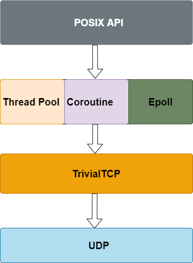  
## 问题简述
IP 层是「不可靠」的，它只负责数据包的发送，但它不保证数据包能够被接收、不保证网络包的按序交付、也不保证网络包中的数据的完整性。  
如果需要保障网络数据包的可靠性，那么就需要由上层（传输层）的 TCP 协议来负责。
TCP 是一个工作在传输层的可靠数据传输的服务，它能确保接收端接收的网络包是无损坏、无间隔、非冗余和按序的。  
**挑战**
- 阅读TCP相关RFC
- 完成所给框架基础架构完善
- 实现连接管理、可靠传输、流量控制、拥塞控制等TCP核心模块
## TCP模块预览
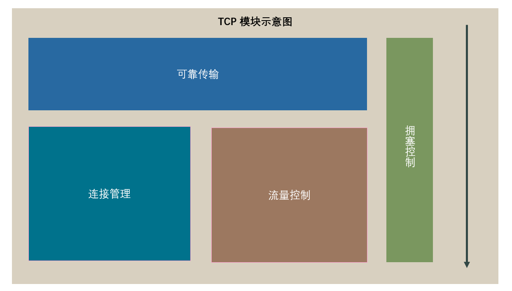

## 项目功能实现情况
- **实践要求功能**
- [x] 环境搭配
- [x] 连接管理
- [x] 计时器
- [x] 可靠传输
- [x] 流量控制
- [x] 拥塞控制
- **额外功能**
- [x] 系统API
- [x] 线程池
- [x] 协程
- [ ] Epoll机制

## 测试结果梗概
- 完成全部任务
- 完美通过全部测试
----

# 任务分析

### 任务分配
> 除去对基础架构的完善部分，TCP实现的主要功能分为连接管理、可靠传输、流量控制、拥塞控制四大模块。

## 四模块任务简要分析

### 可靠传输

可靠传输是TCP实现的核心内容，TCP能够保证处理消息不冗余，不缺失，不乱序，不会不完整等可靠特性是基于可靠传输来实现的。  
TCP通过ACK SEQ来确保TCP段的正确接收，通过校验和等方式确认收到的段是否正确，通过五元组确认是否收到了正确连接的TCP段。

### 流量控制

对于众多多用户多进程主机来说，操作系统是无法保证TCP接收方的接收缓存中的数据能够立即被处理掉，所以为了防止因为缓冲区已满而被迫丢弃已有数据导致的不必要的
额外带宽流量占用，TCP的流量模块应运而生。  
流量控制模块通过在TCP segment中添加自己剩余接收窗口大小来让对方获取到应该发送多少数据从而避免溢出的情况。
流量控制模块通过改善窗口算法，延迟ACK算法以及Nagle算法，根据接收方的窗口大小，对TCP段的发送进行管理，避免SWS现象（愚蠢窗口综合征）。

### 连接管理

TCP协议要求客户端和服务端通过三次握手发起连接。首先，由客户端调用 connect() 方法主动向服务端发起连接，向服务端发送带有 SYN 标志段的 packet，
当服务端接受到分组后向客户端返回带有 ACK 标志位，随后客户端向服务端发送带有 ACK 标志位的分组，至此三次握手正式完成。
断开连接与连接过程类似，同样由一端发起断开连接请求（即发送 FIN 标志位的报文），双方经过协商与状态机转换后最终同时关闭连接并释放资源。

### 拥塞控制
根据协议，TCP不应该抢占整个通信信道，若否则会造成整个通信信道的堵塞，而且网络状况非常多变，受到多种因素的制约，TCP无法预定一个预设的数值来判断网络情况。  
而拥塞控制就是这样一种自适应算法的集合，可以根据RTT以及接收方ACK的情况自适应的调节拥塞窗口来保证整个传输的平稳以及适应通信环境的各种情况。
拥塞控制算法为数据发生者增设了一个“拥塞窗口（congestion window，cwnd）”，并且有三种拥塞状态，分别是慢启动，拥塞避免和快速恢复。  
拥塞控制核心要点就是通过目前接受的ACK情况和超时的次数和预设的ssthresh来自适应拥塞窗口大小。

----
# 协议设计
## 总体设计
我们小组将整个TCP实现分为四大模块，和其他额外的设计，四大模块的分配方式如上文任务分析提到。
对于任务分配部分，如下表：  
**齐呈祥**
- 连接管理
- 可靠传输
- 系统API，线程池，协程（额外工作）   

**高树韬**
- 流量控制
- 拥塞控制

### 总体设计划分

对于一个完整的TCP流程，最开始的部分是连接管理，先通过连接管理模块完成三次握手，并且要在连接管理模块当中处理各种连接出错的情况。  
成功建立完整连接后，就由可靠传输负责接手整个传输过程，保证传输的可靠性。而传输的窗口大小则由流量控制和拥塞控制来保证不会出现上述任务分析出现的问题。  
### 数据结构设计
**客户端**
```c
	int state; // TCP的状态

	tju_sock_addr bind_addr; // 存放bind和listen时该socket绑定的IP和端口
	// tju_sock_addr target_addr;
	tju_sock_addr established_local_addr; // 存放建立连接后 本机的 IP和端口
	tju_sock_addr established_remote_addr; // 存放建立连接后 连接对方的 IP和端口

	pthread_mutex_t send_lock; // 发送数据锁
	pthread_t send_thread; // 发送线程
	char* sending_buf; // 发送数据缓存区
	int sending_len; // 发送数据缓存长度
	int sending_capacity; // 发送缓冲区容量

	pthread_mutex_t recv_lock; // 接收数据锁
	char* received_buf; // 接收数据缓存区
	int received_len; // 接收数据缓存长度
	int received_capacity; // 接受缓冲区容量

	pthread_cond_t wait_cond; // 可以被用来唤醒recv函数调用时等待的线程

	window_t window; // 发送和接受窗口

	// 保存的半连接队列id
	int saved_syn;

	pthread_mutex_t signal_lock;
	int interrupt_signal;

	// 计时器逻辑
	struct rtt_timer_t* rtt_timer;

	// 超时次数
	uint8_t timeout_counts;

	// 这些域仅在server端被使用
	// 半连接队列
	struct sock_queue* syn_queue;
	// 全连接队列
	struct sock_queue* accept_queue;

    // 拥塞控制相关
    int con_status; //拥塞窗口状态
    int cwnd;//拥塞窗口大小
    int ssthresh;//慢启动阈值

	// 监听socket应当有一个数组维护连接状态
	int listen_state[MAX_SOCK_SIZE];
```

**服务端**  
维持两个list，一个是已建立连接的list，一个是还未建立连接的list。  
每个list中的item都是跟客户端一致的数据结构用来记录一个TCP连接一侧的所需的状态。

### 协议规则
**可靠传输FSM**

**可靠传输发送方**

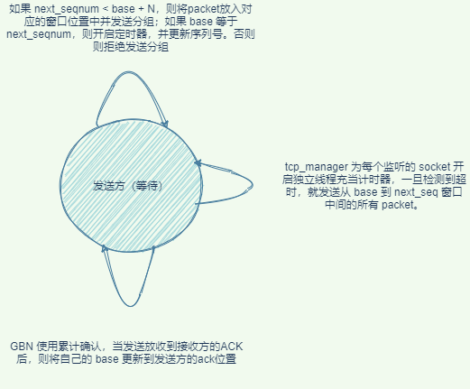


  **可靠传输接收方**

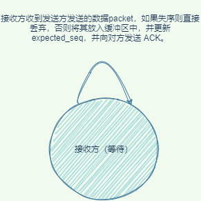  
**三次握手FSM**

**三次握手客户端**

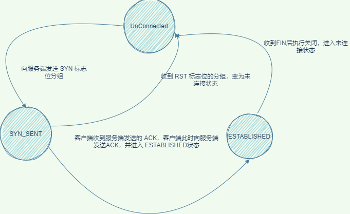  


**三次握手服务端**

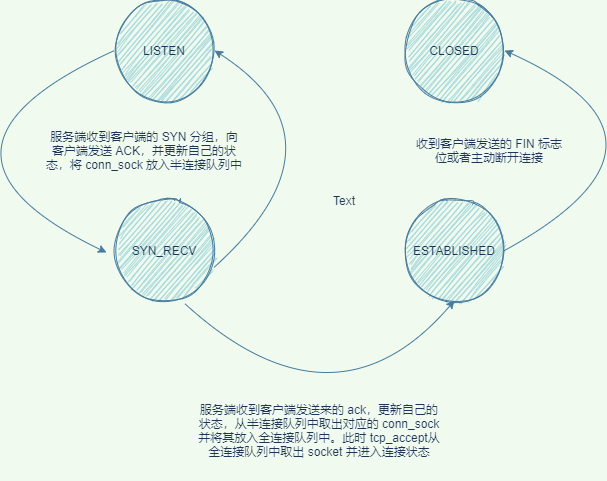  
**拥塞控制FSM**
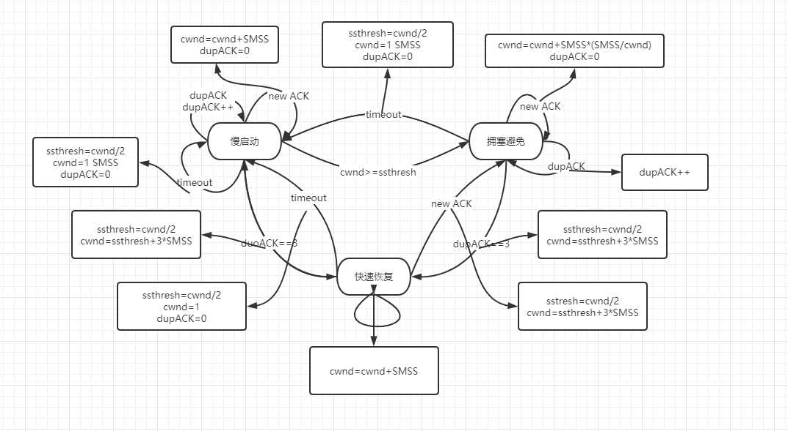  
**流量控制**  

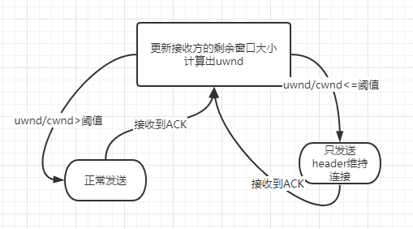
----
# 模块详细实现

## 可靠传输

### 完全可信信道上的可靠传输

如果信道完全可靠，那么可靠传输就不成问题了，此时的可靠传输非常简单。发送方只需要将数据放到信道上它就可以可靠的到达接收方，并由接收方接收。
但是这种信道是完全理想化的，不存在的。

### 会出现比特错误的信道上的可靠传输

更现实一点的信道是会发生比特错误的，假设现在需要在除了会出现比特错误之外，其它的特性和完全可靠信道一样的信道上进行可靠传输.

为了实现该信道上的可靠传输：

- 接收方：需要确认信息是否就是发送方所发送的，并且需要反馈是否有错误给发送方
- 发送方：需要在发送的信息中添加额外信息以使得接收方可以对接收到的信息是否有错误进行判断，并且需要接收接收方的反馈，如果有错误发生就要进行重传

因而在这种信道上进行传输需要三种功能：

- 差错检测：发送方提供额外信息供接收方进行校验，接收方进行校验以判断是否有错误发生。网络协议一般采用校验和来完成该任务
- 接收方反馈：接收方需要将是否有错误发生的信息反馈给发送方，这就是网络协议中最常见的ACK（确认）/NAK（否定的确认）机制
- 发送方重传：在出现错误时，发送方需要重传出错的分组。重传也是网络协议中极常见的机制。

上述机制还有问题，它没有考虑接收方的反馈出现比特错误 即**反馈受损**的情形。采用上述机制，在反馈受损时，发送方可以了解到这个反馈信息出现了错误，但是它无法知道反馈的是什么样的信息，因此也就无法知道自己该怎么应对。

这可以有两种解决办法：

- 发送方提供足够多的信息，使得接收方不仅可以检测比特错误，而且可以恢复比特错误。这在仅会发生比特错误的信道上是理论可行的，代价是需要大量额外的信息。
- 如果收到了受损的反馈，则都认为是出现了错误，就进行重传。但是这时就可能引入冗余的分组，因为被重传的分组可能已经正确的被接收了。

网络协议中广泛采用的是第2种解决方案，冗余分组可以通过一种简单的机制来解决，这就是分组序列号。被发送的每个分组都有一个序列号，接收方只需要检测该序列号就可以知道分组是否是冗余的。


在引入序列号后，该机制已经可以在这种信道上工作了。不过它还可以做一点变化，有些网络协议中并不会产生否定的确认（即报告发送方出现了错误），它采用的是继续为 已经为之发送过ACK的最后一个正确接收的分组 发送ACK。当发送方收到冗余的ACK时就知道跟在被冗余ACK确认的分组之后的分组没有被正确接收，这就达到了NAK所要的效果。

在我们的实现中，我们在每个 `socket` 中维护了两个窗口：发送窗口和接收窗口，其中发送窗口维护 `base` 和 `nextseq` 两个 field，分别用来表示当前发送但仍未收到 ACK 的第一个 pakcet 的序列号以及下一个将要发送 packet 的序列号。借此可以实现 GBN 窗口移动算法。接收窗口维护 `expectd_seq` 用来判断发送方发来的分组是否失序，只要当发送方发来的分组的序列号等于 `expected_seq` 的时候才接收。

我们进行通信的流程如下所示：

```
用户发送数据，TrivialTCP 将数据放入发送缓冲区中 ---> 发送线程不断轮询发送缓冲区，当发现缓冲区中存在数据，将其封装头部，送入下层协议，开启定时器 --->
接收方收到分组，判断检验和是否正确，若不正确则丢弃 ---> 判断 seq 的值是否与 expected_seq 相同，若不相同则丢弃 packet -->
关闭定时器，并送入接收缓冲区中
```
其中，倘若计时器发现超时，则会调用回调函数进行处理。

**涉及到的方法：**
- `int tcp_check(tju_packet_t* pkt)`：判断检验和是否正确，若正确返回 TRUE，否则返回 FALSE。
- `int tcp_check_seq(tju_packet_t* pkt, tju_tcp_t* sock)`：检查序列号是否正确。
- `static unsigned short tcp_compute_checksum(tju_packet_t* pkt)`：计算检验和。
- `void* tcp_send_stream(void* arg)`：使用 GBN 算法，轮询发送缓冲区，并将缓冲区内容发送给下层协议。


## 连接管理

### 三次握手

TCP协议要求客户端和服务端通过三次握手发起连接。首先，由客户端调用 `connect()` 方法主动向服务端发起连接，向服务端发送带有 `SYN` 标志段的 packet，当服务端接受到分组后向客户端返回带有 `ACK` 标志位，随后客户端向服务端发送带有 `ACK` 标志位的分组，至此三次握手正式完成。

当服务端接受到 `SYN` packet 之后，会将新建客户端 socket并将其加入到半连接队列中`syns_socks`中，我们 `socket` 队列的定义如下:

```c
typedef struct sock_node {
    tju_tcp_t* data;
    struct sock_node* next;
} sock_node;

typedef struct sock_queue {
    int size;
    sock_node* base;
} sock_queue;
```

其中我们为 `sock_queue` 实现了队列的各种基础算法。

当服务端再次接受到客户端发来的 `ACK` 报文时，则将半连接队列中的 `scoket` 发送给全连接队列 `accept_socks`，此时 `accept()` 方法中检测到 `accept_socks` 中收到的分组，随后则将监听 `socket` 状态修改为 `ESTABLISHED`,并加入 `established_socks` 中。

客户端的处理过程与服务端类似， `connect()` 主动向服务端发送报文，随后阻塞等待直到 `connect_sock` 不为 NULL。

其中关于接收报文的过程则在一个子线程中进行。当内核检测到接受到分组后，则将其交给 `onTCPPocket()` 来处理分组，我们使用 `tcp_manager` 来全局管理 TCP 的连接状态。 其中， `onTCPPocket()`分为不同情况来处理分组：

- 当服务端未建立连接时，即不能在哈希表找到对应的 socket 时，此时交给 `tcp_rcv_state_server()` 处理。
- 当客户端未建立连接，即不能在连接哈希表中找到对应的 socket 时，此时交给 `tcp_rcv_state_client()` 处理。
- 当服务端建立连接，即能在连接哈希表中找到对应的 socket 且状态为 ESTABLISHED 时，交给 `tju_handle_packet()` 处理
- 当客户端建立连接，即能在连接哈希表中找到对应的 socket 且状态为 ESTABLISHED 时，交给 `tju_handle_packet()` 处理
- 当客户端或服务端处于关闭状态，即收到的分组标志位为 `FIN` 或者状态不是 ESTABLISHED，此时交给 `tcp_state_close()` 处理

其中， `tcp_rcv_state_server()` 和 `tcp_rcv_state_client()` 方法来分别处理服务端与客户端握手时的状态机转换过程；`tju_handle_packet()` 用来处理可靠传输，`tcp_state_close()` 用来处理套接字关闭。 

**涉及到的方法：**

- `int tcp_rcv_state_server(tju_tcp_t* sock, char* pkt, tju_sock_addr* conn_addr);`: 服务端三次握手的状态转换过程。 参数：服务端socket， 收到的分组，待连接的服务端socket。返回值为处理是否成功，成功返回0，失败返回1。
- `int tcp_rcv_state_client(tju_tcp_t* sock, char* pkt, tju_sock_addr* conn_sock)`: 客户端三次握手的状态转换过程。 参数：客户端socket，收到的分组，待连接的服务端socket。返回值为处理是否成功，成功返回0，失败返回1。


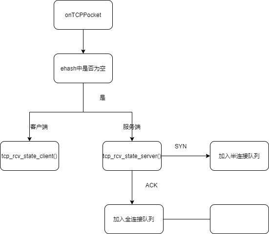

### 断开连接（四次挥手）

断开连接与连接过程类似，同样由一端发起断开连接请求（即发送 `FIN` 标志位的报文），双方经过协商与状态机转换后最终同时关闭连接并释放资源。具体实现细节这里不再进行赘述。


**涉及到的方法：**
- `int tcp_state_close(tju_tcp_t* local_sock, char* recv_pkt)`: 关闭连接过程的状态机转换。参数： 本地socket， 接收到的分组。返回值为处理是否成功，成功返回0，失败返回-1。


## 定时器的设计

当应用程序创建 socket 时，我们将会调用 `tcp_init_timer()` 为计时器进行初始化，其中 `timeout` 域先设置为1，注册`callback`, 随后当我们开始传输分组时，我们调用回调函数开始计时。

当我们受到 ACK 之后，我们需要调用  `tcp_ack_update_rtt()` 来更新 RTT， 其中 `tcp_ack_update_rtt()` 实现如下：

```c
int tcp_ack_update_rtt(tju_tcp_t* sock, float seq_rtt_us, float sack_rtt_us) {

    /* Prefer RTT measured from ACK's timing to TS-ECR. This is because
	 * broken middle-boxes or peers may corrupt TS-ECR fields. But
	 * Karn's algorithm forbids taking RTT if some retransmitted data
	 * is acked (RFC6298).
	 */
	if (seq_rtt_us < 0)
		seq_rtt_us = sack_rtt_us;

    tcp_set_estimator(sock, seq_rtt_us);
    tcp_set_rto(sock);
    return 0;
}
```

我们需要分别对 `extimator_rtt` 和 `dev_rtt` 进行更新之后再去设置 `timeout`。

定时器的结构设计如下所示：

```c
typedef struct rtt_timer_t {
    float estimated_rtt;
    float dev_rtt;
    float timeout;
    void (*callback)(tju_tcp_t* sock);
} rtt_timer_t;
```

其中包含定时器计算 RTT 的基础数据域以及回调函数 `callback()`，其中，我们需要将回调函数注册为 ` tcp_write_timer_handler()`，`tcp_write_timer_handler()` 的处理流程为开始计时即调用函数，倘若在规定时间内未收到 ACK，则根据 socket 当前的状态进行处理，例如超时则需要重传，倘若超出了重传次数，则需要启用慢启动重新开始。下图为该过程的一个图示：

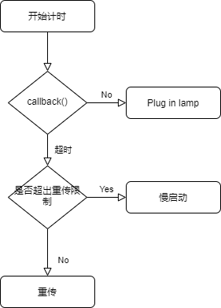

关于定时器如何监测是否超时，首先，我们调用 `time_after()` 来判断是否超时，在该函数中我们新建一个线程开始计时，并通过通道监测信号量：


```c
// 检查是否超时
void* tcp_check_timeout(void* arg) {
    // 这里我们异步监测是否超时，倘若超时则调用回调函数
    // 否则监测到中断信号返回
    tju_tcp_t* sock = (tju_tcp_t*)arg;
    float timeout = sock->rtt_timer->timeout;
    time_t cur_time = time(NULL);
    time_t out_time = cur_time + timeout;
    // 初始化信号量
    while(time(NULL) < out_time) {
        if (sock->interrupt_signal == 1) {
            printf("receive interrupt signal.\n");
            // 更新RTT的值
            tcp_ack_update_rtt(sock, time(NULL) - cur_time, 1);
            sock->rtt_timer->chan = NULL;
            return NULL;
        }else {
            // 休息一会，防止不断轮询导致CPU负载过重
            sleep(1);
        }
    }
    // 此时超时，调用回调函数
    sock->rtt_timer->callback(sock);
}
```


当收到 ACK 时，我们向计时器传递信号量并停止计时，重置计时器，否则调用回调函数。根据不同的 socket 状态进行处理：

```c
// 当计时器超时时的回调函数
void tcp_write_timer_handler(tju_tcp_t* sock) {
    printf("timeout.\n");
    // 这里需要针对socket的状态进行不同的操作
    switch(sock->state) {
        case SYN_SENT:
            tcp_send_syn(sock);
        case SYN_RECV:  
            tcp_send_syn_ack(sock);
        case ESTABLISHED: 
            // 超时重传，这里或许需要判断一下重传的次数，若重传次数过多应该关闭连接
            if(sock->timeout_counts > RETRANSMIT_LIMIT) {
                // 重传次数超限，关闭连接
                printf("重传次数超限，关闭连接.\n");
                tcp_outlimit_retransmit(sock);
            }else {
                // 重传分组
                sock->timeout_counts += 1;
                tcp_retransmit_timer(sock);
            }
        default:
            printf("Unresolved status.\n");
    }
}

```

**涉及到的方法：**
- `void tcp_init_timer(tju_tcp_t* sock, void (*retransmit_handler)(unsigned long))`: 初始化定时器并注册回调函数。 参数：待注册socket， 回调函数指针。 无返回值。
- `void tcp_init_rtt(tju_tcp_t* sock)`： 初始化RTT，仅仅在 `tcp_init_timer()` 中被调用。 参数： 待注册socket。 无返回值。
- `void tcp_set_estimator(tju_tcp_t* sock, float mrtt_us)`： 更新平滑RTT和RTT偏差值。 参数： 本地socket， 接收到ACK的RTT。 无返回值。
- `void tcp_bound_rto(tju_tcp_t* sock)`： 更新RTO，在 `tcp_set_estimator()` 后调用。 参数： 本地socket。 无返回值。
- `void tcp_set_rto(tju_tcp_t* sock)`：  仅仅调用 `tcp_bound_rto()`。
- `int tcp_ack_update_rtt(tju_tcp_t* sock, float seq_rtt_us, float sack_rtt_us)`： 收到 ACK 后更新 RTT，调用 `tcp_set_rto()` 和 `tcp_set_estimator()`。 参数：本地socket， 收到的RTT， 保底RTT。 成功返回0，失败返回-1。
- `void tcp_write_timer_handler(tju_tcp_t* sock)`：注册的回调函数，根据当前 socket 的不同状态进行处理，无返回值。
- `void tcp_start_timer(tju_tcp_t* sock)`: 开启定时器计时，无返回值。
- `void tcp_stop_timer(tju_tcp_t* sock)`：停止计时器计时并更新 RTT 的值，无返回值。
- `void tcp_retransmit_timer(tju_tcp_t* sock)`：超时重传函数处理，无返回值。
- `void tcp_entry_loss(tju_tcp_t* sock)`：超时慢启动处理，无返回值。
- `void tcp_outlimit_retransmit(tju_tcp_t* sock)`：超时重传次数过多，此时应当主动关闭连接。

## 流量控制
在TCP的RFC中，TCP不拥有一块固定最大大小的接收缓存用于储存未被上层处理的已接受的TCP segment,因为对于服务器来说，时间分片或者其他CPU调度算法是一定存在的，
用户无法保证接收到的数据会被立即处理，所以缓存是必须存在的。对于TCP这样的可靠传输来说，丢弃溢出的TCP段会造成对于网络链路带宽的浪费，因为丢弃的段一定会被重传
用于保证可靠传输，所以流量控制就显得异常重要。

对于最简单的流量控制算法，仅仅在header中添加空闲空间，会导致SWS(愚蠢窗口综合征)，简单地描述就是，当接收方应用进程处理数据缓慢时，会导致空闲空间较少，
而发送方会在有空闲的情况下就发送数据，导致在极端情况下，发送方发送1字节的数据需要20字节的head用于TCP segment封装，所以流量控制也要尽量避免SWS。
### 改进窗口算法

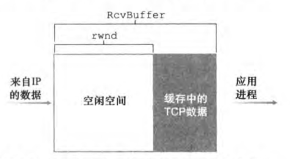

发送方根据接收方的rwnd,已接受的ack和发送的seq计算出接收方的useable window size, 如果其比值小于某个阈值则延迟发送新的数据，仅仅发送一个HEAD用于维持链接。

改进窗口算法可以从发送方的角度避免SWS，而且在开销很小的情况下实现完全限度的避免SWS。

关键函数实现如下所示：

```c
int improve_send_wnd(tju_tcp_t* sock){
    float rwnd = (float)sock->window.wnd_send->rwnd;
    float data_on_way = (float)sock->window.wnd_send->nextseq - sock->window.wnd_send->base;
    if((rwnd-data_on_way)/rwnd<IMPROVED_WINDOW_THRESHOLD){
        return 0;
    }else{
        return 1;
    }
}
```

在本函数中，会根据对方的rwnd和自身记录的已发送和对方已ack的大小计算出在路上的数据总量，然后用uwnd/rwnd得出一个比例，
若小于预设的阈值（通常为25%）那么就发送数据，否则就等待对方空闲的足够多为止。

### 改善确认算法

前提：receiver 才能控制ACK 需要一个timer计数

当收到一个TCP段的时候，如果同时满足push bit  没有被设置并且没有revised window需要发回，那么就设置一个timer，间隔时间为大致为200ms~300ms，最合适的时间为自适应算法。

`void handle_delay_ack(tju_tcp_t* sock, char* pkt)`

在 `handle_TCP_PKT` 函数调用于控制ACK返回的延迟具体逻辑详见下图：

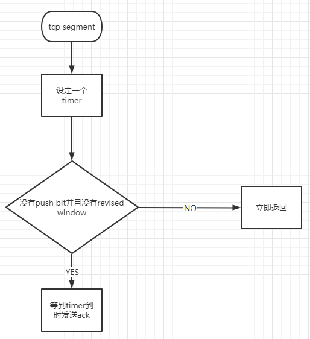


## 拥塞控制

### 简介

拥塞控制是TCP中重要的一个部分，为了防止单个tcp连接无限占用带宽导致的囚徒困境，拥塞控制部分限制了在相对稳定情况下tcp连接自适应网络情况保持最好的传输效率。

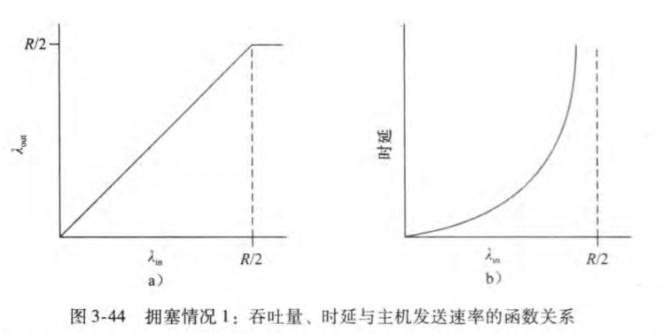
如图所示，发送速率过高会导致排队时延无限增长，所以，通过自适应的算法取得一个合适的拥塞控制值是非常有必要的。

## 拥塞状态

对于本项目，拥塞状态分为三部分，以及两个预定义值

````c
// TCP 拥塞控制状态
#define SLOW_START 0
#define CONGESTION_AVOIDANCE 1
#define FAST_RECOVERY 2
// 预定义值 测试需求所以搞笑了
#define IW 3*MAX_DLEN
#define SMSS MAX_DLEN
````
### Slow Start（慢启动）
（ssthresh：slow start thresh，慢启动门限值）
当cwnd的值小于 ssthresh 时，TCP 则处于 slow start 阶段，每收到一个 ACK，cwnd的值就会加1。
经过一个RTT的时间，cwnd的值就会变成原来的两倍，为指数增长。

### Congestion Avoidance（拥塞避免）
当 cwnd 的值超过 ssthresh 时，就会进入 Congestion Avoidance 阶段，在该阶段下，cwnd以线性方式增长，大约每经过一个 RTT，cwnd 的值就会加1
### Fast Retransmit（快重传）
按照拥塞避免算法中 cwnd 的增长趋势，迟早会造成拥塞（一般通过是否丢包来判断是否发生了拥塞）。
如果中网络中发生了丢包，通过等待一个 RTO 时间后再进行重传，是非常耗时的，因为 RTO通常设置得会比较大（避免伪重传：不必要的重传）。
快重传的思想是：只要发送方收到了三个重复的 ACK，就会立马重传，而不用等到 RTO 到达（如果没有3个重复的 ACK 而包丢失了，就只能超时重传）；
并且将 ssthresh 的值设置为当前 cwnd 的一半，而cwnd减为1，重回slow start阶段。

### Fast Recovery（快速恢复）算法。
当收到三个重复的 ACK 或是超过了 RTO 时间且尚未收到某个数据包的 ACK，Reno 就会认为丢包了，并认定网络中发生了拥塞。
Reno 会把当前的 ssthresh 的值设置为当前 cwnd 的一半，但是并不会回到 slow start 阶段，而是将cwnd设置为（更新后的）ssthresh+3MSS，之后cwnd呈线性增长。

## 状态转换

状态机

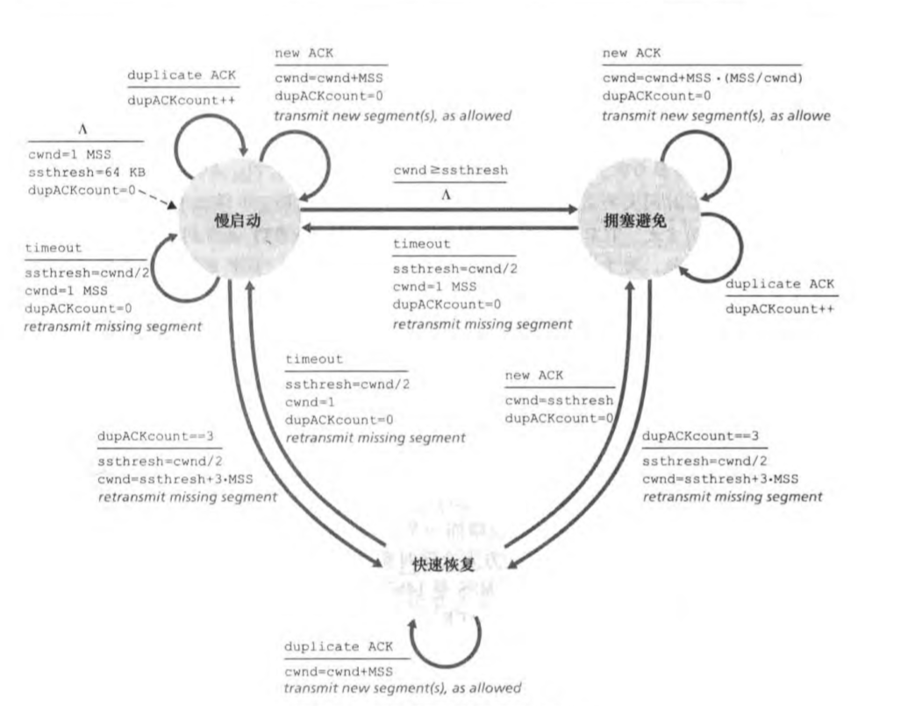
**对于正确返回ack的情况的函数**

````c
void handle_success_ack(tju_tcp_t* sock){
    if(sock->con_status==SLOW_START){
        //慢启动时则每收到一个ack就增加一个smss
        sock->cwnd=sock->cwnd+SMSS;
        if(sock->cwnd>sock->ssthresh){
            //如果超出阈值则进入拥塞避免状态
            sock->con_status=CONGESTION_AVOIDANCE;
        }
    }else if(sock->con_status==CONGESTION_AVOIDANCE){
        //根据rfc 在拥塞避免时 窗口线性增长
         sock->cwnd=sock->cwnd+SMSS*(SMSS/sock->cwnd);
    }else if(sock->con_status==FAST_RECOVERY){
        //快速重传则增加一个SMSS然后变为拥塞避免
        sock->cwnd=sock->cwnd+SMSS;
        sock->con_status=CONGESTION_AVOIDANCE
    }else{
        printf("handle_success_ack 出现未定义行为\n");
    }
}
````

**超时处理的函数 **

````c
void handle_loss_ack(tju_tcp_t* sock) {
    //计算超时次数
    int timeout_counts=sock->timeout_counts%4;
    if(sock->con_status==SLOW_START){
        //慢启动则将窗口变为一个SMSS然后阈值减半到目前窗口大小的一半
        sock->ssthresh=(sock->cwnd+1)/2;
        sock->cwnd=1*SMSS;
        if(sock->cwnd>sock->ssthresh){
            sock->con_status=CONGESTION_AVOIDANCE;
        }
    }else if(sock->con_status==CONGESTION_AVOIDANCE&&timeout_counts==3){
        //如果超时三次则进入快速重传
        sock->ssthresh=(sock->cwnd+1)/2;
        sock->cwnd=sock->ssthresh+3*SMSS;
        sock->con_status=FAST_RECOVERY;
    }else if(sock->con_status==FAST_RECOVERY){
        //如果快速重传超时则进入慢启动
        sock->ssthresh=(sock->cwnd+1)/2;
        sock->cwnd=3*sock->ssthresh;
        sock->con_status=SLOW_START;
    }else{
        printf("不存在相应状态\n");
    }
}
````
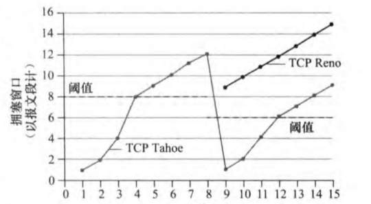
