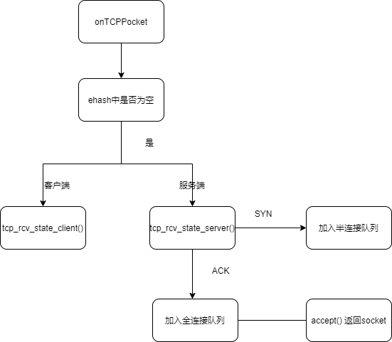

<!--
backgroundImage: url('assets/bg-lead.png')
-->

# TrivialTCP 设计报告
齐呈祥 高树韬

---
## Outline
- 项目简介
- 总体设计
- 设计实现
  - 连接管理
  - 可靠传输、
  - 定时器的设计
  - 流量控制
  - 拥塞控制
- 总结与展望

---
## 项目简介
TrivialTCP 是一个开源的使用C语言编写的TCP协议开源库。  

我们使用 UDP 来模拟 IP 层去收发 packet，其中 TrivialTCP 是本项目中最核心的部分，它保证了能够进行可靠传输。我们在顶层模块暴露了类似 POSIX 标准的 API 供上层应用使用，因此我们可以为上层的应用程序提供服务。
 
我们也打算去实现一些高性能的组件运行在 TrivialTCP 上层，例如线程池、协程以及Epoll 机制，目前线程池和协程已经实现，Epoll 正在实现中。


---
## 总体设计


--- 
## 设计实现
**连接管理**



---
TCP协议要求客户端和服务端通过三次握手发起连接。首先，由客户端调用 `connect()` 方法主动向服务端发起连接，向服务端发送带有 SYN 标志段packet，当服务端接受到分组后向客户端返回带有 ACK 标志位，随后客户端向服务端发送带有 ACK 标志位的分组，至此三次握手正式完成。

`syns_socks` 中，我们 `socket` 队列的定义如下: 
```c
typedef struct sock_node { tju_tcp_t* data; 
struct sock_node* next; 
} sock_node; 
typedef struct sock_queue { 
    int size; 
    sock_node* base; 
} sock_queue;
```
---

其中我们为 `sock_queue` 实现了队列的各种基础算法。当服务端再次接受到客户端发来的 ACK 报文时，则将半连接队列中 scoket 发送给全连
接队列 `accept_socks` ，此时 `accept()` 方法中检测到 `accept_socks` 中收到的分组，随后则将监听 socket 状态修改为 `ESTABLISHED` ,并加入 `established_socks` 中。

客户端的处理过程与服务端类似， `connect()` 主动向服务端发送报文，随后阻塞等待直到 `connect_sock` 不为 NULL。
其中关于接收报文的过程则在一个子线程中进行。当内核检测到接受到分组后，则将其交给   `onTCPPocket()` 来处理分组，我们使用 `tcp_manager` 来全局管理 TCP 的连接状态。 其
中， `onTCPPocket()` 分为不同情况来处理分组.


---
**可靠传输** 


---
在我们的实现中，我们在每个 `socket` 中维护了两个窗口：发送窗口和接收窗口，其中发送窗口维护 `base` 和 `nextseq` 两个 field，分别用来表示当前发送但仍未收到 ACK 的第一个 pakcet 的序列号以及下一个将要发送 packet 的序列号。借此可以实现 GBN 窗口移动算法。接收窗口维护 `expectd_seq` 用来判断发送方发来的分组是否失序，只要当发送方发来的分组的序列号等于 `expected_seq` 的时候才接收。 

**定时器的设计** 
当应用程序创建 socket 时，我们将会调用 `tcp_init_timer()` 为计时器进行初始化，其中 `timeout` 域先设置为1，注册`callback`, 随后当我们开始传输分组时，我们调用回调函数开始计时。

---

当我们受到 ACK 之后，我们需要调用  `tcp_ack_update_rtt()` 来更新 RTT， 其中 `tcp_ack_update_rtt()` 实现如下：

```c
int tcp_ack_update_rtt(tju_tcp_t* sock, float seq_rtt_us, float sack_rtt_us) {

    /* Prefer RTT measured from ACK's timing to TS-ECR. This is because
	 * broken middle-boxes or peers may corrupt TS-ECR fields. But
	 * Karn's algorithm forbids taking RTT if some retransmitted data
	 * is acked (RFC6298).
	 */
	if (seq_rtt_us < 0)
		seq_rtt_us = sack_rtt_us;

    tcp_set_estimator(sock, seq_rtt_us);
    tcp_set_rto(sock);
    return 0;
}
```
---

我们需要分别对 `extimator_rtt` 和 `dev_rtt` 进行更新之后再去设置 `timeout`。

定时器的结构设计如下所示：

```c
typedef struct rtt_timer_t {
    float estimated_rtt;
    float dev_rtt;
    float timeout;
    void (*callback)(tju_tcp_t* sock);
} rtt_timer_t;
```

---

其中包含定时器计算 RTT 的基础数据域以及回调函数 `callback()`，其中，我们需要将回调函数注册为 ` tcp_write_timer_handler()`，`tcp_write_timer_handler()` 的处理流程为开始计时即调用函数，倘若在规定时间内未收到 ACK，则根据 socket 当前的状态进行处理，例如超时则需要重传，倘若超出了重传次数，则需要启用慢启动重新开始。


下图为该过程的一个图示： 

---


---
**流量控制**

---
**拥塞控制**

---
**其他**

---
## 总结与展望
**总结**
在本次实验中我们从零实现了一个 TCP 的协议栈的子集（仍有许多协议没有实现），熟悉了网络底层是如何进行可靠传输的，极大地提升了系统开发能力以及团队协作能力。

**未来展望**
- 支持更多协议
- 提高性能
- 开发基于 TrivialTCP 的用户库及系统 API


---
<style scoped>
h1 {
  margin-top: 15%;
  font-size: 100pt;
}
</style>
# 谢谢大家!


